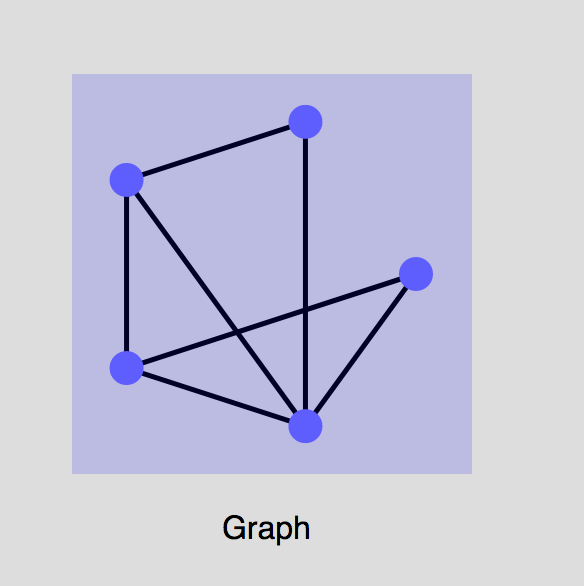

GraphDisplay
============

This package creates SVG images of graphs.  

```
import DisplayGraph

testGraph =
    Graph vertices edges


vertices =
    [ Vertex 1 "A", Vertex 2 "B", Vertex 3 "C", Vertex 4 "D", Vertex 5 "E" ]


edges =
    [ ( 1, 2 ), ( 1, 3 ), ( 2, 3 ), ( 2, 4 ), ( 2, 5 ), ( 3, 4 ), ( 4, 5 ) ]

svgImage = graphDisplay 100 testGraph
```

The `100` is a scale factor.  For a demo, run

```
$ elm make GraphDemo.elm
```

in the root of this folder.



